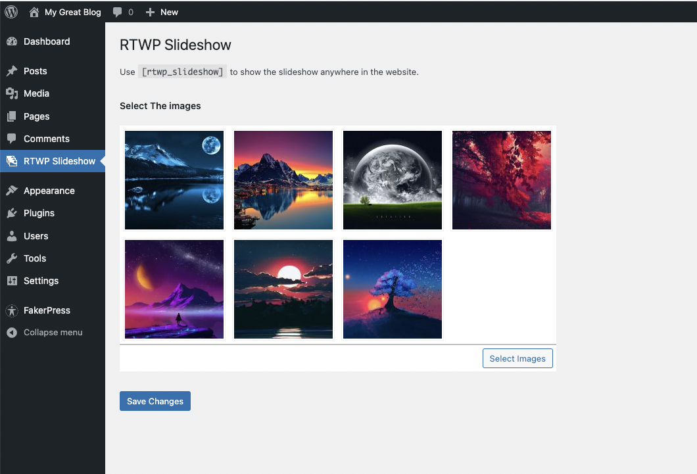
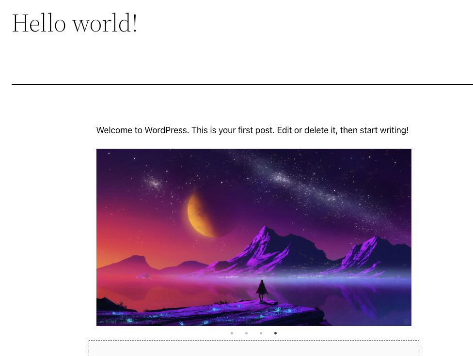

# Wordpress Slideshow Plugin

## About the Plugin
Through this plugin you will be able add images slideshow anywhere in the webiste like in Posts, Pages, or even in Widgets useing the \[wpsi_slideshow\] shortcode. The plugin has very simple interface where you can select the images just from the WorpPress media and sort them according to your preferences.

## Demo Images

#### Back-End View

#### Front-End View

## How to install this plugin in WordPress website
Follow the following steps to install the plugin.
1. You need to go to WordPress admin area and visit **Plugins » Add** New page.
2. After that, click on the ‘Upload Plugin’ button on top of the page, you will see the plugin upload form.
3. Click on the ‘Choose File’ button and select the plugin file you downloaded earlier to your computer.
4. After you have selected the file, you need to click on the ‘Install Now’ button.

_WordPress will now upload the plugin file from your computer and install it for you. You will see a success message like this after the installation is finished._

## License
This project is licensed under the MIT License.

## Author
[Muhammad Ibrar](https://profiles.wordpress.org/ibrar1991/)
